# 用户流程图设计

## 1. 整体用户流程架构

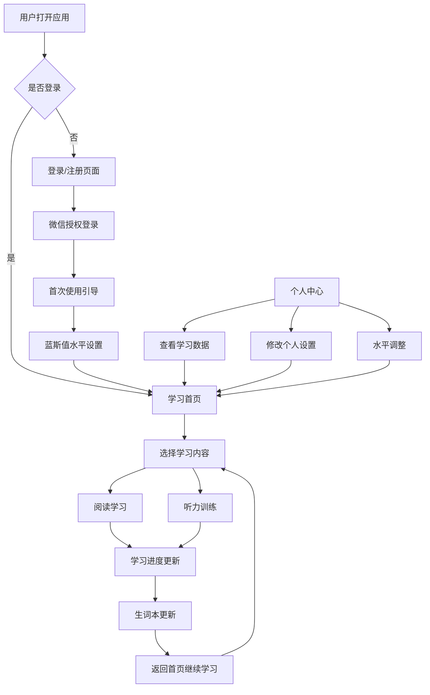

## 2. 新用户引导流程

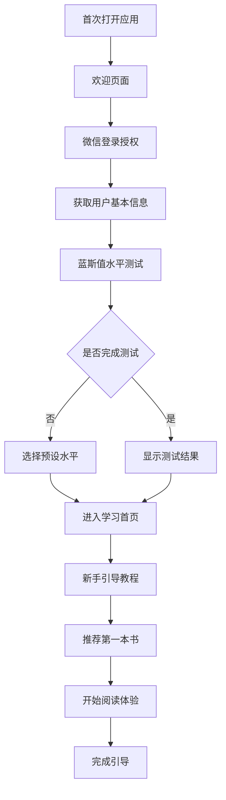

## 3. 核心学习流程

### 3.1 阅读学习流程

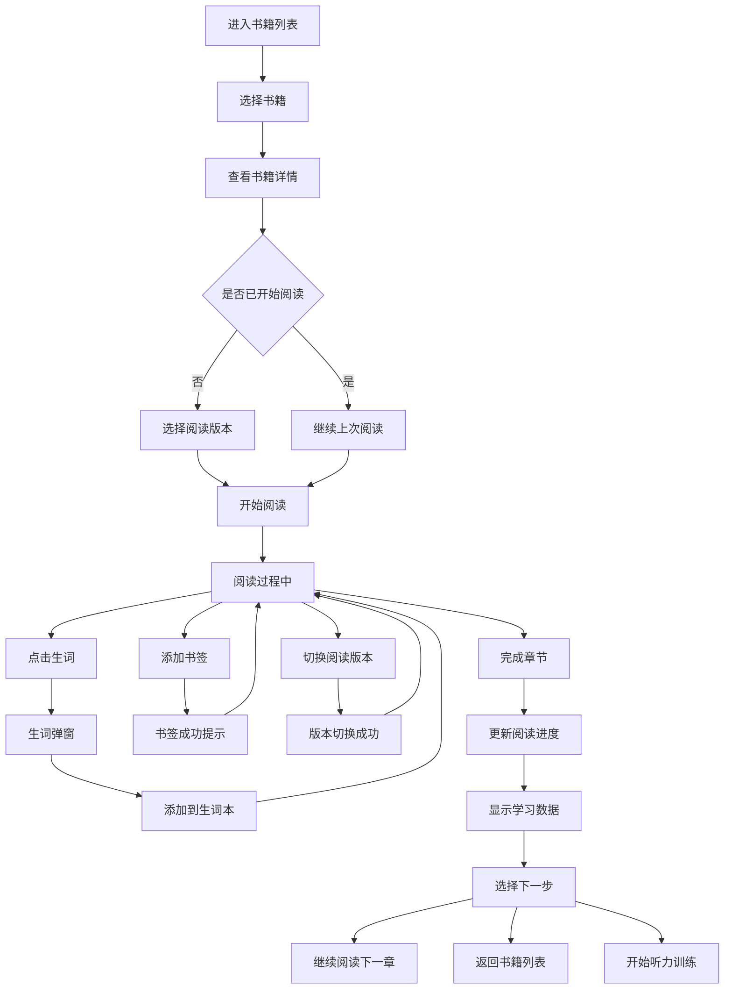

### 3.2 听力训练流程

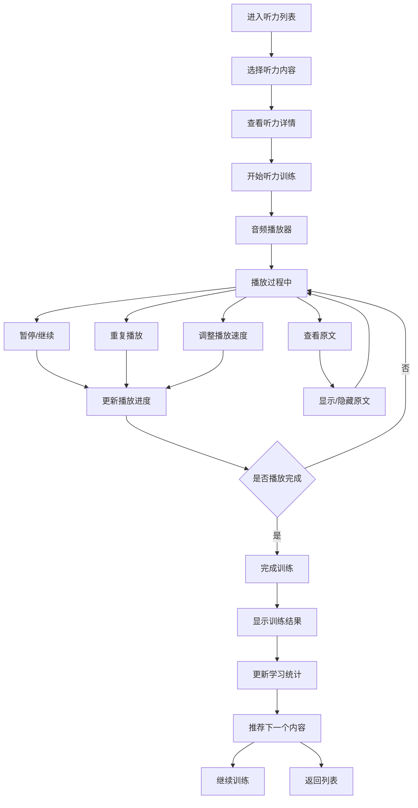

### 3.3 词汇复习流程

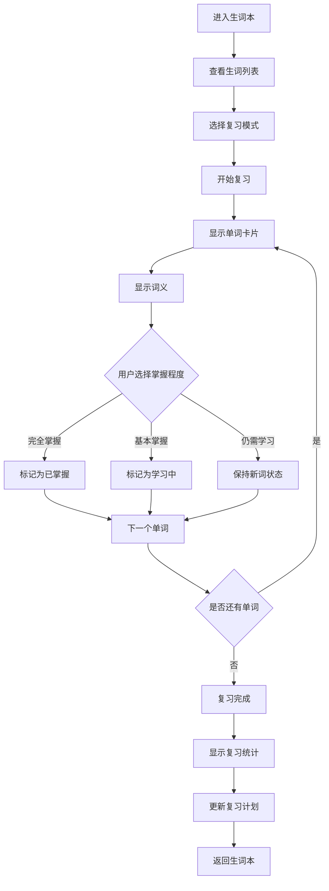

## 4. 用户设置流程

### 4.1 个人资料设置

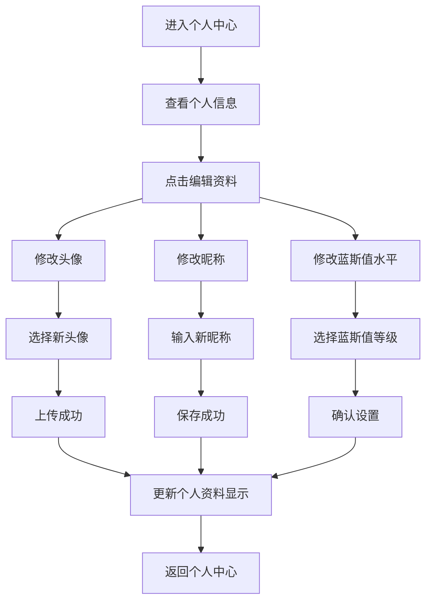

### 4.2 学习偏好设置

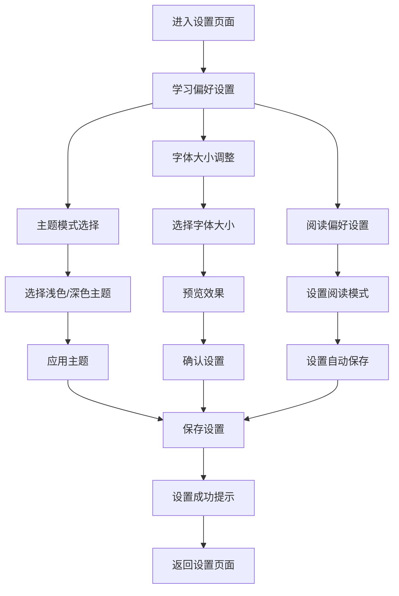

## 5. 数据同步流程

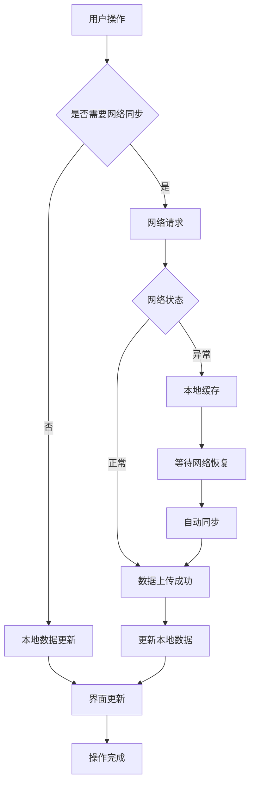

## 6. 简化后的核心用户路径

### 6.1 日度学习路径

```
打开应用 → 查看今日学习概览 → 一键继续上次学习 → 
完成学习内容 → 查看简要进度 → 关闭应用
```

**时间优化**: 从原来的8-10步减少到4-5步

### 6.2 周度学习路径

```
周一: 设置本周学习目标
周二-周四: 每日完成学习任务
周五: 查看周度学习报告
周六: 词汇复习和巩固
周日: 自由选择学习内容
```

### 6.3 月度学习路径

```
月初: 系统推荐月度学习计划
月中: 调整学习难度和内容
月末: 查看月度学习成就
```

## 7. 错误处理和异常流程

### 7.1 网络异常处理

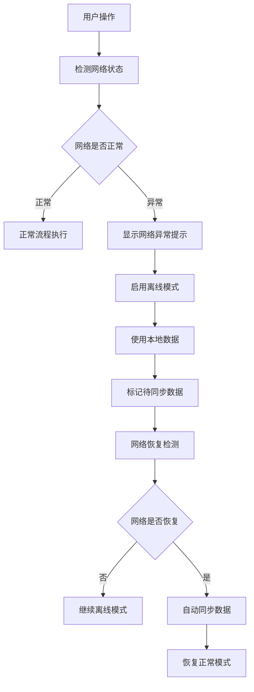

### 7.2 数据加载异常处理

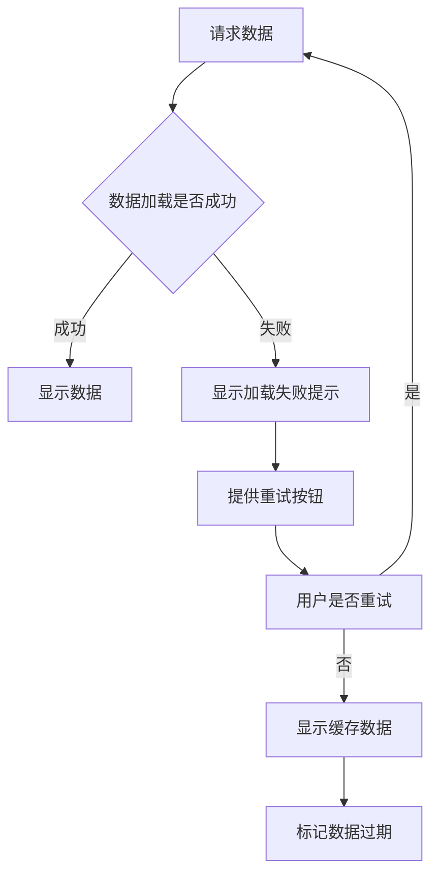

## 8. 性能优化流程

### 8.1 页面加载优化

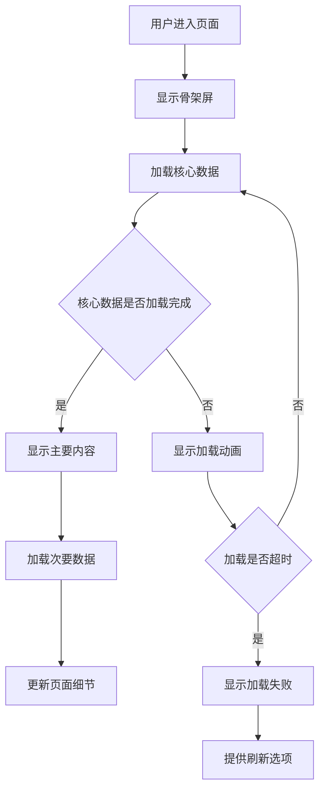

## 9. 用户体验优化点

### 9.1 智能推荐流程

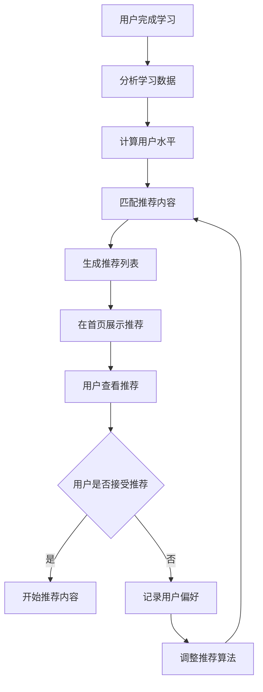

### 9.2 成就激励流程

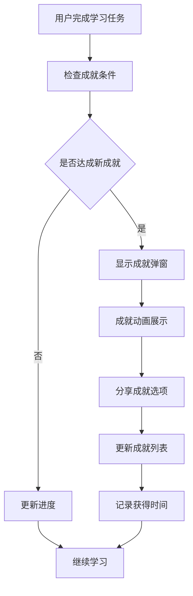

---

**文档版本**: v1.0  
**创建日期**: 2025-10-29  
**说明**: 本流程图基于简化架构设计，专注于核心学习体验
